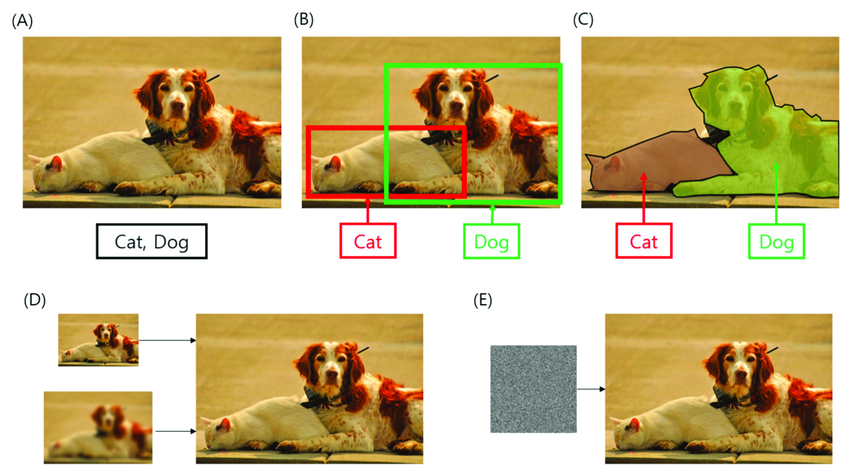

# EE6222 Machine Vison

# 1.Introduction

Machine vision plays a crucial role in automation, enabling systems to process and interpret visual data from the world. 

This course introduces the fundamental concepts and techniques used in **image processing, video analysis, three-dimensional vision, and machine learning** for vision-based automation systems.

### **Course Objectives:**

1. **Fundamentals of Image Processing** – Understand image formation, preprocessing, and enhancement techniques.
2. **Machine Learning for Vision** – Explore classification, pattern recognition, and deep learning approaches for visual data.
3. **3D Machine Vision** – Learn techniques such as stereo vision, shape-from-shading, and model-based recognition.
4. **Video Analytics** – Gain insights into video representation, gesture recognition, and action recognition.
5. **Real-World Applications** – Discover how machine vision is applied in automation, robotics, and industrial settings.

This course is designed for MSc students and professionals interested in **computer vision, automation, and AI-powered visual recognition**. As industries increasingly rely on intelligent vision systems, expertise in this field is highly valuable.

### What You’ll Find Here:

- **Personal Solutions to Past Exams** – Step-by-step solutions to previous exam questions to aid your understanding and preparation.
- **Lecture PPT Example References** – Detailed walkthroughs of key examples and exercises presented in lecture slides.
- **Analysis of Challenging Topics** – In-depth explanations of complex concepts to help you navigate difficult areas with ease.

If you find this repository useful, please consider **starring⭐ it on GitHub** to show your support!



# 2.**Course Aims**

This course aims to introduce to students the basic concepts of vision-based automation systems in industrial and practical settings. Vision-based automation system involve image processing and analysis, video analysis, three-dimensional data processing, machine learning and intelligence. This course covers these topics appropriately.

# 3.**Course Content**

Machine Vision plays a major role in automation. This course is centered around the usage of images, videos and other visual information for automation. Hence, this course covers image processing, image analysis, image recognition, machine learning, video recognition, three dimensional machine vision and their applications in automation.

# 4.**Course Outline**

**Fundamentals of Image, Processing and Transforms (6 hours)**

Image formation. Pre-processing. Spatial domain & frequency domain operations.

**Image Denoising, Enhancement and Manipulation (6 hours)**

Nonlinear processing and Histogram equalization. Rank order statistical filter, Binary and gray scale morphological operations. Local orientation of image.

**Decision, Classification and Machine Learning (9 hours)**

Decision boundaries. Machine learning for decision. Unsupervised learning and K-means clustering. Nearest neighbor classifiers, Linear classifiers, Minimum distance classifiers, Neural networks, Deep convolutional neural networks and their application in machine vision.

**Visual Data Dimensionality Reduction (6 hours)**

Data representation, Eigenvalue and eigenvectoer decomposition, principal component analysis, Linear discriminant analysis, critical roles of dimensionality reduction in visual data recognition.

**Three-dimensional Machine Vision (6 hours)**

Reflectance map, shape from shading, Stereovision techniques. Motion detection, Surface recovery from range data. Binocular stereo vision. Model-based recognition. 3D model representations.

**Video Recognition (6 hours)**

Video representation, Spatio-temporal feature extraction from video, Gesture recognition, Action recognition and activity recognition.

# 5. **Reading and References**

1. Davies E. R., Computer Vision: Principles, Algorithms, Applications, Learning, Elsevier Science, Academic Press, 2017.

2. Rafael C. Gonzalez, Richard E. Woods, Digital image processing, Pearson, 4th Edition, 2018

3. Duda R. O., Hart P. E. , and Stork D. G., Pattern Classification, John Wiley & Sons, 2001

# 6.Content: ALL

## 6.1 English

1.Image basis and human perception

2 LSI linear translation invariant systems and transformations

3.Image enhancement

4.Morphological image processing

5.Intuitive understanding of visual object recognition, from matching to classification to machine learning

6.MAP decision and classifier

7.Statistical estimation and machine learning

8.Manual feature generation and feature selection

9 Visual data dimensionality reduction as feature extraction

10.Neural networks and Deep Machine learning: from MLP to CNN

11 Deep Learning: From CNN to Transformer

12. Video analytics
13. Video recognition
14. 3D machine perception
15. 3D machine vision

## 6.2Chinese

1.图像基础与人类感知

2 LSI线性平移不变系统与转换

3.图像增强

4 形态学图像处理

5.视觉对象识别的直观理解, 从匹配到分类再到机器学习

6.MAP决策与分类器

7.统计估计和机器学习

8.手工特征生成和特征选择

9 视觉数据降维作为特征提取

10 神经网络和深度机器学习:从MLP到CNN

11 深度学习:从CNN到Transformer

12.视频分析

13.视频识别

14.三维机器感知

15.三维机器视觉

# 7. Machine vision, exam scope

Chapter 2, linear translation invariant systems and transformations

In Chapter 9, dimension reduction of visual data is used as feature extraction

Chapter 10, Neural Networks and Deep Learning, from MLP to CNN

Chapter 12, Video analysis

Chapter 13, Video recognition

Chapter 14, 3D machine perception

Chapter 15, 3D machine Vision

第二章，线性平移不变系统与转换

第九章，视觉数据降维作为特征提取

第十章，神经网络与深度学习，从MLP到CNN

第十二章，视频分析

第十三章，视频识别

第十四章，三维机器感知

第十五章，三维机器视觉

# 8. Content

## 8.1 English

2 LSI linear translation invariant systems and transformations

2.1 Image decomposition and linear translation invariant image processing system

2.1.1. Image decomposition

2.1.2. Pulse

2.1.3. Translation and zooming pulse

2.1.4. Image decomposition


2.2 Two-dimensional convolution and its properties

2.2.1. Processing system

2.2.2. Linear processing system

2.2.3 Two-dimensional convolution

2.2.4 Convolution characteristics

2.2.5 Impulse response


2.3 Two-dimensional Fourier transform and its properties

2.3.1 Fourier transform and its inverse transformation

2.3.2 Independent and separable

2.3.3 Discrete Fourier Transform (DFT)

2.3.4 Discrete Fourier Transform (DFT) properties

2.3.4.1 Can be decomposed

2.3.4.2 Periodic, symmetric, linear, Convolution

2.3.4.3 Translation, rotation and translation do not change


2.4 Image Sampling

2.4.1 The image becomes discrete after continuous sampling

2.4.2 Sampling function

2.4.3 Image x sampling

2.4.4 Restoring Continuous Images

2.4.5 Sampling theorem


9 Visual data dimensionality reduction as feature extraction

9.1 Feature Extraction and Dimension Reduction

9.2 PCA, Principal component analysis

9.3 LDA, linear discriminant analysis

9.4 Classification of subspace/feature space


10 Neural Networks and Deep Learning, from MLP to CNN

10.1 Network structure and neuron model

10.1.1 Neural networks and deep CNNS

10.1.2 Neuron model

10.1.3 Activating functions


10.2 Multi-layer perceptron and backpropagation

10.2.1 ANN

10.2.1.1 Multi-Layer Perceptron (MLP)

10.2.1.2 Single-layer neural network

10.2.1.3 Learning curve and decision boundaries

10.2.1.4 Backpropagation

10.2.1.5 Local Minimum Problem

10.2.1.6 Understanding Overfitting

10.2.1.7 Conclusion of neural network


10.2.2 History of neural networks

10.2.3 Function of image recognition module

10.2.4 Supervised learning

10.2.5 Deep Learning

10.2.6 Problems with machine learning

10.2.7 Regularization


10.3 Convolutional Neural network CNN

10.3.1 Convolutional network CNN seems to be different from MLP

10.3.2 Features of Convolutional network CNN

10.3.3 1x1 Convolution

10.3.4 Advantages of Convolutional Networks, CNN


12 Video: Generated

12.1. Autoencoder


12.2. Antagonistic learning

12.2.1. GANs

12.2.2.Conditional GANs

12.2.3.Super Resolution GANs

12.2.4. CycleGAN

12.2.5.Diffusion Probabilistic Models

12.2.6.Video GAN

12.2.7.StoryGAN: A sequential condition GAN for story visualization

12.2.8. Two-stream VAN for video generation

12.2.9.Sora: Video generation model as a world simulator


13 Video: Analysis/Enhancement

13.1. Target detection and tracking

13.1.1 Detection and tracking

13.1.1.1 Detecting/dividing objects

13.1.1.2 Association Detection


13.1.2 Identifying the Re-ID again


13.1.3 Joint Detection and Embedding (JDE)


13.2. Behavior recognition

13.3. Video event/exception detection

13.3.1 Behavior Identification

13.3.2 Long-term Recurrent Convolutional Network Long-term Recurrent Convolutional Network

13.3.3 C3D: 3D convolutional network

13.3.4 Hidden Two streams


13.4. Video enhancement

13.4.1 Blur model

13.4.2 Deconvolution of fuzzy images

13.4.2.1 Point Spread Function (PSF) Point Spread Function (PSF)

13.4.3 Deep video deblur

13.4.4 Video Turbulence Effect Remove. Video turbulence effect remove


13.5. Optical flow

13.5.1 What is Optical Flow?

13.5.2 Optical Flow Hypothesis

13.5.2.1 Spatial coherence

13.5.2.2 Persistence of time

13.5.2.3 Constraints on the brightness constant

13.5.3 Brightness constant equation

13.5.4 Constraints on the brightness constant


13.6. Video segmentation

13.6.1. Introduction to segmentation: pixel input, pixel output

13.6.2 Convnets are classified

13.6.3 R-CNN

13.6.4 U-Net Architecture

13.6.4.1 Shrink phase

13.6.4.2 Expansion Phase

13.6.4.3 U-Net Summary

13.6.5 Image segmentation and video segmentation


14 3D

14.1 3D Method

14.1.1. Flight time

14.1.2. Lidar

14.1.3. Structured light

14.1.4. Motion construction

14.1.4.1 Introduction: Reconstruct scene geometry and camera position from two or more images

14.1.4.2 Pixel mapping: Tracking

Harris Corner

SIFT

Scale space

Descriptor

Object Detection

SuperPoint

Image robust matching strategy

(a) Key point space outlier rejection

(b) Match many features - find a good identical graph

RANSAC cycle

SuperGlue

LoFTR: Transformer-based local feature matching without detector

Key point tracking: Lucas-Kanade Tracker

affine cameras


14.1.4.3 Projection model

Affine structure in motion affine structure

Affine ambiguity. Affine ambiguity


14.1.5. Stereoscopic imaging

14.1.5.1.3D Video Principles

14.1.5.2. Stereo depth

14.1.5.3. Stereo matching


14.2 3D meets deep learning

14.2.1 Introduction to 3D

14.2.2 3D CNN volume data


14.3 GAN for 3D

14.3.1 From single image to volume

14.3.2 From single image to point cloud

14.3.3 From image to shape

14.3.4 From image to surface

## 8.2 Chinese

2 LSI线性平移不变系统与转换

2.1 图像分解与线性平移不变图像处理系统 

2.1.1.图像分解

2.1.2.脉冲 

2.1.3.平移和放大缩小脉冲

2.1.4.图像分解 


2.2 二维卷积及其性质 

2.2.1.处理系统 

2.2.2.线性处理系统

2.2.3 二维卷积 

2.2.4 卷积特性 

2.2.5 脉冲响应 


2.3 二维傅里叶变换及其性质 

2.3.1 傅里叶变换及其逆变换

2.3.2 独立可分离

2.3.3 离散傅里叶变换(DFT) 

2.3.4 离散傅里叶变换(DFT) 性质

2.3.4.1可分解

2.3.4.2 周期、对称、线性、卷积

2.3.4.3 平移、旋转和平移不变变换


2.4 图像采样 

2.4.1 连续采样后变为离散图像

2.4.2 采样函数

2.4.3 图像x采样

2.4.4 恢复连续图像

2.4.5 采样定理


9 视觉数据降维作为特征提取

9.1 特征提取/降维介绍

9.2 PCA，主成分分析

9.3 LDA，线性判别分析

9.4 子空间/特征空间的分类


10 神经网络与深度学习，从MLP到CNN

10.1网络结构和神经元模型

10.1.1 神经网络和深度CNN 

10.1.2 神经元模型 

10.1.3 激活函数


10.2多层感知器与反向传播

10.2.1 人工神经网络 ANN

10.2.1.1 多层感知器(MLP) 

10.2.1.2 单层神经网络 

10.2.1.3 学习曲线和决策边界 

10.2.1.4 反向传播  

10.2.1.5 局部极小问题 

10.2.1.6 理解过拟合 

10.2.1.7 神经网络的结论 


10.2.2 神经网络历史

10.2.3 图像识别模块的功能 

10.2.4 监督学习 

10.2.5 深度学习

10.2.6 机器学习的问题

10.2.7 正则化 


10.3卷积神经网络CNN

10.3.1 卷积网络CNN似乎与MLP不同

10.3.2 卷积网络CNN的特点 

10.3.3 1x1卷积

10.3.4 卷积网络的优点，CNN 


12 视频：生成

12.1.自动编码器


12.2.对抗学习

12.2.1.GANs

12.2.2.Conditional GANs

12.2.3.Super Resolution GANs

12.2.4.CycleGAN

12.2.5.Diffusion Probabilistic Models 

12.2.6.Video GAN

12.2.7.StoryGAN：用于故事可视化的顺序条件GAN

12.2.8.用于视频生成的双流VAN 

12.2.9.Sora：作为世界模拟器的视频生成模型


13 视频：分析/增强 

13.1.目标检测与跟踪

13.1.1 检测与跟踪

13.1.1.1 检测/分割 物体 

13.1.1.2 关联检测


13.1.2 重新识别Re-ID


13.1.3 联合检测与嵌入（JDE）


13.2.行为识别  

13.3.视频事件/异常检测

13.3.1 行为识别

13.3.2 长期循环卷积网络 Long-term Recurrent Convolutional Network 

13.3.3 C3D: 3D卷积网络

13.3.4 隐藏二流Hidden Two Stream 


13.4.视频增强

13.4.1 模糊模型Blur model 

13.4.2 模糊图像反卷积

13.4.2.1 点扩展函数Point Spread Function (PSF) 

13.4.3 深度视频去模糊Deep video deblur 

13.4.4 视频湍流效果消除Video Turbulence Effect Remove 


13.5.光流

13.5.1 什么是光流？

13.5.2 光流假设

13.5.2.1 空间相干性

13.5.2.2 时间的持久性

13.5.2.3 亮度常数约束

13.5.3 亮度常数方程

13.5.4 亮度常数约束


13.6.视频分割

13.6.1.介绍分割：像素输入，像素输出

13.6.2 Convnets进行分类

13.6.3 R-CNN

13.6.4 U-Net架构

13.6.4.1收缩阶段 

13.6.4.2扩张阶段 

13.6.4.3 U-Net总结

13.6.5 图像分割与视频分割


14 3D

14.1 3D方法 

14.1.1.飞行时间

14.1.2.激光雷达

14.1.3.结构光

14.1.4.运动构造 

14.1.4.1 介绍：从两个或多个图像重建场景几何和相机位置 

14.1.4.2 像素对应：跟踪

Harris Corner

SIFT

Scale space

Descriptor

Object Detection

SuperPoint

图像鲁棒匹配策略

(a)关键点空间离群值拒绝

(b)匹配许多特征——寻找一个好的相同图

RANSAC循环

SuperGlue

LoFTR：基于变压器的无检测器局部特征匹配

关键点跟踪：Lucas-Kanade Tracker

affine cameras


14.1.4.3投影模型 

运动中的仿射结构Affine structure

仿射模棱两可 Affine ambiguity


14.1.5.立体成像

14.1.5.1.3D视频原理

14.1.5.2.立体深度

14.1.5.3.立体匹配


14.2 3D遇上深度学习

14.2.1 介绍3D

14.2.2 三维CNN体积数据


14.3 GAN for 3D

14.3.1 从单个图像到体积

14.3.2 从单个图像到点云

14.3.3 从图像到形状

14.3.4 从图像到表面

# 9.List of GitHub

`````
├─1.Exam
│      21-S1-Q1-NO.pdf
│      21-S1-Q2-NO.pdf
│      21-S1-Q3-NO.pdf
│      21-S1-Q4-NO.pdf
│      21-S1-Q5-NO.pdf
│      22-S1-Q1-v3.pdf
│      22-S1-Q2-v3-NO.pdf
│      22-S1-Q3-v2-NO.pdf
│      22-S1-Q4-v3.pdf
│      22-S1-Q5-v3.pdf
│      23-S1-Q1-v4-NO.pdf
│      23-S1-Q2-v2-NO.pdf
│      23-S1-Q3-v5.pdf
│      23-S1-Q4-v3.pdf
│      23-S2-Q1-NO.pdf
│      23-S2-Q2-v3-NO.pdf
│      23-S2-Q3-v9.pdf
│      23-S2-Q4-v3.pdf
│      
├─2.PPT Example
│      Example2.1.4.pdf
│      Example2.2.5 impulse response.pdf
│      
├─3.Understand
│      1.傅里叶变换【不加mn】-v2.pdf
│      10.Auto-encoder.pdf
│      11.GANs.pdf
│      12.conditional GANs.pdf
│      13.Cycle GANs.pdf
│      14.Diffusion model.pdf
│      15.Video GAN.pdf
│      16.Object detection&Tracking.pdf
│      17.Action Recognition.pdf
│      18.Motion blur.pdf
│      19.Optical flow.pdf
│      2.图像采样.pdf
│      20.Video segmentation.pdf
│      21.3D method.pdf
│      22.基于尺度不变关键点的鲜明图像特征.pdf
│      23.结构运动-相机模型、欧拉角、追踪方法.pdf
│      24.6427 CNN.pdf
│      25.Feature Matching.pdf
│      26.Affine Structure from Motion.pdf
│      27.3D立体匹配：立体深度，极限约束.pdf
│      28.立体匹配：基本思想与PSM Net.pdf
│      29.3D+deep learning.pdf
│      3.PCA&LDA-v3.pdf
│      4.欧拉公式.pdf
│      5.full connect NN.pdf
│      6.特征值与特征向量的定义.pdf
│      7.关于卷积操作内核反转的问题的回复.pdf
│      8.EE6222 23-S2-Q3助教回复.pdf
│      9.CJ-review.pdf
│      EE6222-热门考点分析.xlsx
│      考试必背.pdf
│      
├─4.Resource
│  ├─1.Outline
│  │      EE6222_OBTL (Abridge).pdf
│  │      
│  └─2.BOOK
│      │  生成对抗网络入门指南（第2版）.pdf
│      │  
│      └─1.图像处理与机器视觉
│          └─北交-图像处理与机器学习
│              ├─{10}--第七章深度学习基础
│              │  ├─{1}--7.1引言
│              │  │      (10.1.1)--7.1引言.pdf
│              │  │      
│              │  ├─{2}--7.2卷积神经网络
│              │  │      (10.2.1)--7.2卷积神经网络.pdf
│              │  │      
│              │  └─{3}--7.3深度学习网络
│              │          (10.3.1)--7.3深度学习网络.pdf
│              │          
│              ├─{11}--第八章非监督学习
│              │  ├─{1}--8.1聚类算法
│              │  │      (11.1.1)--8.1聚类算法.pdf
│              │  │      
│              │  ├─{2}--8.2主成份分析（上）
│              │  │      (11.2.1)--8.2主成份分析（上）.pdf
│              │  │      
│              │  └─{3}--8.3主成份分析（下）
│              │          (11.3.1)--8.3主成份分析（下）.pdf
│              │          
│              ├─{12}--第九章应用实例
│              │  ├─{1}--9.1复杂背景下的人脸检测算法
│              │  │      (12.1.1)--9.1.1复杂背景下的人脸检测算法预处理.pdf
│              │  │      (12.1.2)--9.1.2复杂背景下的人脸检测算法特征提取.pdf
│              │  │      (12.1.3)--9.1.3复杂背景下的人脸检测算法分类器设计.pdf
│              │  │      
│              │  └─{2}--9.2基于深度学习的车辆检测算法
│              │          (12.2.1)--9.2基于深度学习的车辆检测算法.pdf
│              │          
│              ├─{13}--大作业
│              │  ├─{1}--大作业（上）车牌检测与字符分割
│              │  │      #13.1.1#--程序框架.pdf
│              │  │      #13.1.2#--实验图像.pdf
│              │  │      (13.1.1)--大作业（上）车牌检测与字符分割.pdf
│              │  │      (13.1.2)--车牌分割程序框架.rar
│              │  │      (13.1.3)--车牌分割实验图像.rar
│              │  │      
│              │  └─{2}--大作业（下）车牌字符识别
│              │          #13.2.1#--实验图像训练集.pdf
│              │          #13.2.2#--实验图像测试集.pdf
│              │          (13.2.1)--大作业（下）车牌字符识别.pdf
│              │          (13.2.2)--车牌识别实验图像training.rar
│              │          (13.2.3)--车牌识别实验图像testing.rar
│              │          
│              ├─{14}--附录1实验平台搭建设置讲解(enhance）
│              │  └─{1}--实验平台搭建设置讲解
│              ├─{15}--附录2实验平台完整版（含所有算法代码）
│              │  └─{1}--实验平台完整版（含所有算法代码）
│              │          #15.1.1#--实验平台完整版（含所有算法代码）压缩包1.pdf
│              │          #15.1.2#--实验平台完整版（含所有算法代码）压缩包2.pdf
│              │          (15.1.1)--演示平台压缩包1.rar
│              │          (15.1.2)--演示平台压缩包2.rar
│              │          
│              ├─{16}--期末考试
│              ├─{1}--第一章绪论
│              │  ├─{1}--绪论
│              │  │      (1.1.1)--0绪论PPT.pdf
│              │  │      
│              │  ├─{2}--1-1基本概念
│              │  │      (1.2.1)--1-1基本概念1PPT.pdf
│              │  │      
│              │  ├─{3}--1-2基本概念（续）
│              │  │      (1.3.1)--1-2基本概念（续）.pdf
│              │  │      
│              │  ├─{4}--1-3图像直方图
│              │  │      (1.4.1)--1-3图像直方图.pdf
│              │  │      
│              │  ├─{5}--第一章讨论
│              │  ├─{6}--课程实验平台及实验图像
│              │  │      #1.6.1#--实验用图像.pdf
│              │  │      #1.6.2#--实验平台程序包1.pdf
│              │  │      #1.6.3#--实验平台程序包2.pdf
│              │  │      (1.6.1)--实验环境及实验平台介绍PPT.pdf
│              │  │      (1.6.2)--bb.rar
│              │  │      (1.6.3)--实验平台程序包1.rar
│              │  │      (1.6.4)--实验平台程序包2.rar
│              │  │      
│              │  ├─{7}--实验一图像显示
│              │  │      (1.7.1)--实验一图像显示.pdf
│              │  │      
│              │  └─{8}--实验二图像直方图
│              │          (1.8.1)--实验二图像直方图.pdf
│              │          
│              ├─{2}--第二章图像增强--空间域
│              │  ├─{1}--2.1引言
│              │  │      (2.1.1)--2.1引言PPT.pdf
│              │  │      
│              │  ├─{2}--2.2灰度变换
│              │  │      (2.2.1)--2.2灰度变换.pdf
│              │  │      
│              │  ├─{3}--2.3直方图均衡
│              │  │      (2.3.1)--2.3直方图均衡.pdf
│              │  │      
│              │  ├─{4}--2.4代数运算
│              │  │      (2.4.1)--代数运算PPT.pdf
│              │  │      
│              │  ├─{5}--2.5空间域滤波低通
│              │  │      (2.5.1)--2-5空间域滤波1PPT.pdf
│              │  │      
│              │  ├─{6}--2.6空间域滤波中值滤波
│              │  │      (2.6.1)--2-5空间域滤波2PPT.pdf
│              │  │      
│              │  ├─{7}--2.7空间域滤波高通
│              │  │      (2.7.1)--2-7空间域滤波高通.pdf
│              │  │      
│              │  └─{8}--图像增强空间域讨论
│              ├─{3}--第二章图像增强--频域
│              │  ├─{1}--2.8二维傅里叶变换定义
│              │  │      (3.1.1)--2.8二维傅里叶变换定义PPT.pdf
│              │  │      
│              │  ├─{2}--2.9二维傅里叶变换性质
│              │  │      (3.2.1)--2.9二维傅里叶变换性质PPT.pdf
│              │  │      
│              │  ├─{3}--2.10频域滤波低通
│              │  │      (3.3.1)--2.10频域滤波低通PPT.pdf
│              │  │      
│              │  ├─{4}--2.11频域滤波高通
│              │  │      (3.4.1)--2.11频域滤波高通PPT.pdf
│              │  │      
│              │  ├─{5}--2.12频域滤波同态滤波
│              │  │      (3.5.1)--2.12频域滤波同态滤波PPT.pdf
│              │  │      
│              │  └─{6}--第二章图像增强--频域讨论
│              ├─{4}--第二章图像增强实验
│              │  ├─{1}--实验三图像直方图均衡
│              │  │      (4.1.1)--实验三直方图均衡PPT.pdf
│              │  │      (4.1.2)--实验平台下载地址.pdf
│              │  │      
│              │  ├─{2}--实验四均值高斯低通滤波
│              │  │      #4.2.1#--实验四实验图像包含噪声的图像.pdf
│              │  │      (4.2.1)--实验四均值高斯低通滤波PPT.pdf
│              │  │      (4.2.2)--包含噪声图像.rar
│              │  │      
│              │  ├─{3}--实验五中值滤波
│              │  │      (4.3.1)--实验五中值滤波PPT.pdf
│              │  │      
│              │  └─{4}--实验六图像边缘提取
│              │          (4.4.1)--实验六图像边缘提取PPT.pdf
│              │          
│              ├─{5}--第三章图像形态学处理
│              │  ├─{1}--3.1形态学基本概念
│              │  │      (5.1.1)--3.1形态学基本概念PPT.pdf
│              │  │      
│              │  ├─{2}--3.2形态学处理算法
│              │  │      (5.2.1)--3.2形态学处理算法PPT.pdf
│              │  │      
│              │  └─{3}--3.3图像形态学处理应用
│              │          (5.3.1)--3.3图像形态学处理应用PPT.pdf
│              │          
│              ├─{6}--第三章图像形态学处理实验
│              │  └─{1}--实验七图像形态学处理
│              │          #6.1.1#--形态学处理实验图像.pdf
│              │          (6.1.1)--实验七图像形态学处理PPT.pdf
│              │          (6.1.2)--二值图像.rar
│              │          
│              ├─{7}--第四章图像分割
│              │  ├─{1}--4.1图像分割引言
│              │  │      (7.1.1)--4.1图像分割引言.pdf
│              │  │      
│              │  ├─{2}--4.2基于阈值的分割算法
│              │  │      (7.2.1)--4.2基于阈值的分割算法.pdf
│              │  │      
│              │  ├─{3}--4.3基于边缘的分割算法
│              │  │      (7.3.1)--4.3基于边缘的分割算法.pdf
│              │  │      
│              │  ├─{4}--4.4霍夫变换
│              │  │      (7.4.1)--4.4霍夫变换.pdf
│              │  │      
│              │  └─{5}--4.5基于区域的分割算法
│              │          (7.5.1)--4.5基于区域的分割算法.pdf
│              │          
│              ├─{8}--第五章贝叶斯决策
│              │  ├─{1}--5.1人工智能简介
│              │  │      (8.1.1)--5.1人工智能简介.pdf
│              │  │      
│              │  ├─{2}--5.2机器学习引言
│              │  │      (8.2.1)--5.2机器学习引言.pdf
│              │  │      
│              │  ├─{3}--5.3贝叶斯公式
│              │  │      (8.3.1)--5.3贝叶斯公式.pdf
│              │  │      
│              │  ├─{4}--5.4贝叶斯决策--最小错误率决策
│              │  │      (8.4.1)--5.4贝叶斯决策--最小错误率决策.pdf
│              │  │      
│              │  ├─{5}--5.5贝叶斯决策--最小风险决策
│              │  │      (8.5.1)--5.5贝叶斯决策--最小风险决策.pdf
│              │  │      
│              │  ├─{6}--5.6判别函数（上）
│              │  │      (8.6.1)--5.6判别函数（上）.pdf
│              │  │      
│              │  ├─{7}--5.7判别函数（下）
│              │  │      (8.7.1)--5.7判别函数（下）.pdf
│              │  │      
│              │  ├─{8}--5.8概率密度估计--参数法
│              │  │      (8.8.1)--5.8概率密度估计--参数法.pdf
│              │  │      
│              │  └─{9}--5.9概率密度估计--非参数法
│              │          (8.9.1)--5.9概率密度估计--非参数法.pdf
│              │          
│              └─{9}--第六章人工神经网络
│                  ├─{1}--6.1人工神经网络引言
│                  │      (9.1.1)--6.1人工神经网络引言.pdf
│                  │      
│                  ├─{2}--6.2单层神经网络
│                  │      (9.2.1)--6.2单层神经网络.pdf
│                  │      
│                  └─{3}--6.3多层神经网络
│                          (9.3.1)--6.3多层神经网络.pdf
│                          
└─README.assets
        A-list-of-computer-vision-algorithms-A-Image-classification-B-Object-Detection-C.png

`````

# 10.Disclaimer

All content in this  is based solely on the contributors' personal work, Internet data.
All tips are for reference only and are not guaranteed to be 100% correct.
If you have any questions, please submit an Issue or PR.
In addition, if it infringes your copyright, please contact us to delete it, thank you.


#### Copyright © School of Electrical & Electronic Engineering, Nanyang Technological University. All rights reserved.
